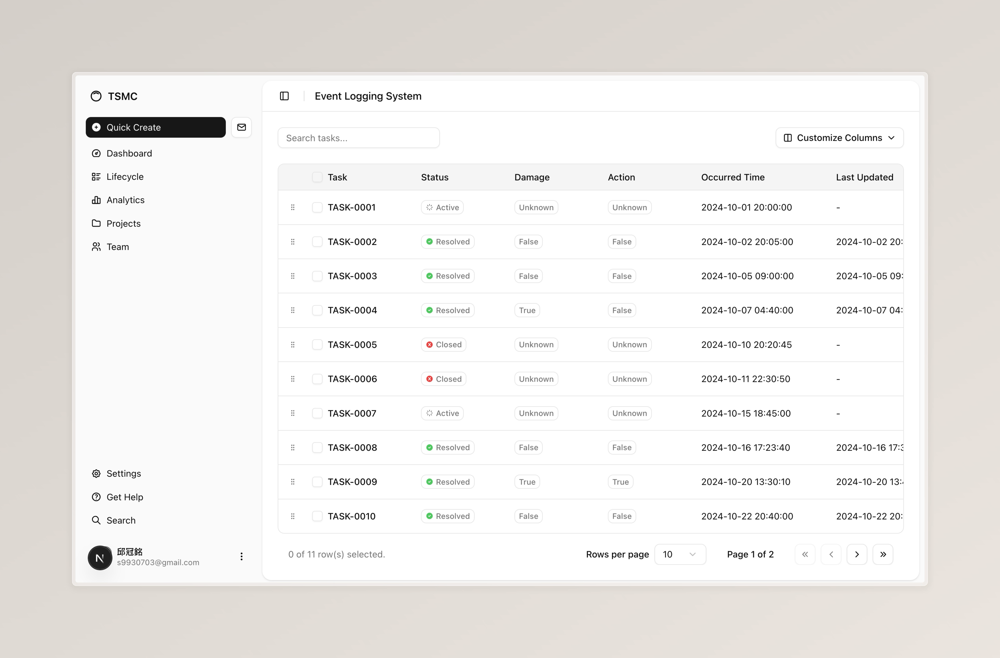

# 🐄 Ground Cow

[](https://github.com/kiwi-rikasa/ground-cow/actions/workflows/build.yml)
[](https://github.com/kiwi-rikasa/ground-cow/actions/workflows/lint.yml)
[](https://github.com/kiwi-rikasa/ground-cow/actions/workflows/test.yml)
[](https://codecov.io/gh/kiwi-rikasa/ground-cow)

Ground Cow is a platform for managing your farm. It is built with [FastAPI](https://fastapi.tiangolo.com/) and [Next.js](https://nextjs.org/).

[](https://github.com/kiwi-rikasa/ground-cow)

## 💻 Development

Start the services

```bash
# Run all services
docker compose --profile all up --build
# or, if 'COMPOSE_PROFILES=all' is set in .env
docker compose up --build

# Run the app
docker compose --profile app up --build -d

# Run the backend (db -> pre-start -> backend)
docker compose --profile backend up --build -d

# Run the airflow
astro dev start  # under ./airflow
```

Stop the services

```bash
# Stop other services
docker compose down -v

# Stop the airflow
astro dev stop  # under ./airflow
```

Access the services at:

- backend: http://localhost:8000
- db admin: http://localhost:8081
- airflow web server: http://localhost:8080
